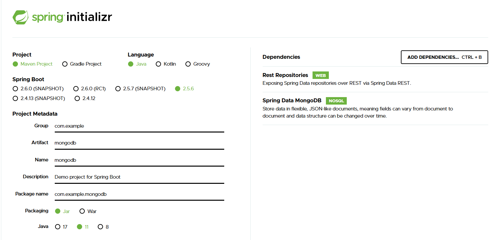

# SPRING-BOOT AND MONGO DB
[Getting Started Guides](https://spring.io/guides/gs/accessing-mongodb-data-rest/)

## Starting with Spring Initializr
- Rest Repositories
- Spring Data MongoDB



## Files
- [Person](src/main/java/com/example/mongodb/model/Person.java)


## DOCKER MONGO DB
```bash
> docker run -d --name database -p 27017:27017 mongo
> docker exec -it database bash
# ls
bin  boot  data  dev  ...  opt  proc  root  run  sbin  srv  sys  tmp  usr  var

# mongo
connecting to: mongodb://127.0.0.1:27017/?compressors=disabled&gssapiServiceName=mongodb
Implicit session: session ...
MongoDB server version: 4.4.4
Welcome to the MongoDB shell.
...

> show dbs
admin   0.000GB
config  0.000GB
local   0.000GB
```

## STARTING APP

GET localhost:8080

```json
{
  "_links" : {
    "people" : {
      "href" : "http://localhost:8080/people{?page,size,sort}",
      "templated" : true
    },
    "profile" : {
      "href" : "http://localhost:8080/profile"
    }
  }
}
```

  
POST localhost:8080/people { "firstName" : "Frodo", "lastName" : "Baggins" }  
POST localhost:8080/people { "firstName" : "Samwise", "lastName" : "Gamgee" }  

GET localhost:8080/people  

```json
{
  "_embedded" : {
    "people" : [ {
      "firstName" : "Frodo",
      "lastName" : "Baggins",
      "_links" : {
        "self" : {
          "href" : "http://localhost:8080/people/6188835bedaa4a057cf7e410"
        },
        "person" : {
          "href" : "http://localhost:8080/people/6188835bedaa4a057cf7e410"
        }
      }
    }, {
      "firstName" : "Samwise",
      "lastName" : "Gamgee",
      "_links" : {
        "self" : {
          "href" : "http://localhost:8080/people/61888399edaa4a057cf7e411"
        },
        "person" : {
          "href" : "http://localhost:8080/people/61888399edaa4a057cf7e411"
        }
      }
    } ]
  },
  "_links" : {
    "self" : {
      "href" : "http://localhost:8080/people"
    },
    "profile" : {
      "href" : "http://localhost:8080/profile/people"
    },
    "search" : {
      "href" : "http://localhost:8080/people/search"
    }
  },
  "page" : {
    "size" : 20,
    "totalElements" : 2,
    "totalPages" : 1,
    "number" : 0
  }
}
```

GET http://localhost:8080/people/search/findByLastName?name=Baggins

```json
{
  "_embedded" : {
    "people" : [ {
      "firstName" : "Frodo",
      "lastName" : "Baggins",
      "_links" : {
        "self" : {
          "href" : "http://localhost:8080/people/6188835bedaa4a057cf7e410"
        },
        "person" : {
          "href" : "http://localhost:8080/people/6188835bedaa4a057cf7e410"
        }
      }
    } ]
  },
  "_links" : {
    "self" : {
      "href" : "http://localhost:8080/people/search/findByLastName?name=Baggins"
    }
  }
}


```

## DOCKER MONGO DB
```bash
> show dbs
admin     0.000GB
config    0.000GB
hobbiton  0.000GB
local     0.000GB

> quit()
```
